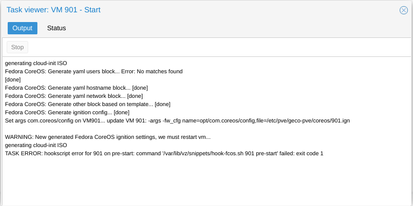

# fedora-coreos-proxmox

Fedora CoreOS template for proxmox

## Create FCOS VM Template

### Configuration

* **vmsetup.sh**

```
TEMPLATE_VMID="1000"                     # Template Proxmox VMID 
TEMPLATE_VMSTORAGE="thin-ssd"           # Proxmox storage  
SNIPPET_STORAGE="local"                 # Snippets storage for hook and ignition file
VMDISK_OPTIONS=",discard=on"            # Add options to vmdisk
```

* **fcos-base-tmplt.yaml**

The ignition file provided is only a working basis.
For a more advanced configuration go to https://docs.fedoraproject.org/en-US/fedora-coreos/

it contains :

* Correct fstrim service with no fstab file
* Install qemu-guest-agent on first boot
* Install Geco-iT CloudInit wrapper
* Raise console message logging level from DEBUG (7) to WARNING (4)
* Add Geco-iT motd/issue

### Script output
```
root@vc0:/opt/fcos-tmplt# ./vmsetup.sh 
Check if vm storage thin-ssd exist... [ok]
Check if snippet storage local exist... [ok]
Copy hook-script and ignition config to snippet storage...
'fcos-base-tmplt.yaml' -> '/var/lib/vz/snippets/fcos-base-tmplt.yaml'
'hook-fcos.sh' -> '/var/lib/vz/snippets/hook-fcos.sh'
Get storage "thin-ssd" type... [block]
Download fedora coreos...
fedora-coreos-32.20201018.3.0-qemu.x86_64.qcow2.xz  100%[=================>] 524.11M  59.8MB/s    in 8.5s    
fedora-coreos-32.20201018.3.0-qemu.x86_64.qcow2.xz (1/1)
  100 %      524.1 MiB / 1779.8 MiB = 0.294    55 MiB/s       0:32             
Create fedora coreos vm 
update VM 900: -agent enabled=1 -autostart 1 -boot c -bootdisk scsi0 -cores 4 -cpu host -memory 4096 -onboot 1 -ostype l26 -tablet 0
update VM 900: -description Fedora CoreOS - Geco-iT Template

 - Version             : 32.20201018.3.0
 - Cloud-init          : true

Creation date : 2020-11-26

update VM 900: -net0 virtio,bridge=vmbr0

Create Cloud-init vmdisk...
update VM 900: -ide2 thin-ssd:cloudinit
importing disk 'fedora-coreos-32.20201018.3.0-qemu.x86_64.qcow2' to VM 900 ...
transferred: 0 bytes remaining: 8589934592 bytes total: 8589934592 bytes progression: 0.00 %
transferred: 91053306 bytes remaining: 8498881286 bytes total: 8589934592 bytes progression: 1.06 %
transferred: 178670639 bytes remaining: 8411263953 bytes total: 8589934592 bytes progression: 2.08 %
...
transferred: 8589934592 bytes remaining: 0 bytes total: 8589934592 bytes progression: 100.00 %
Successfully imported disk as 'unused0:thin-ssd:vm-900-disk-0'
update VM 900: -scsi0 thin-ssd:vm-900-disk-0,discard=on -scsihw virtio-scsi-pci
update VM 900: -hookscript local:snippets/hook-fcos.sh
Convert VM 900 in proxmox vm template... [done]
```

## Operation

Before starting an FCOS VM, we create an ignition file by merging the data from the cloudinit and the fcos-base-tmplt.yaml file.
Then we modify the configuration of the vm to add the loading of the ignition file and we reset the start of the vm.

<p align="center">
  
</p>

## CloudInit

Only these parameters are supported by our cloudinit wrapper:

* User (only one) default = admin
* Passwd
* DNS domain
* DNS Servers
* SSH public key
* IP Configuration (ipv4 only)

The settings are applied at boot
